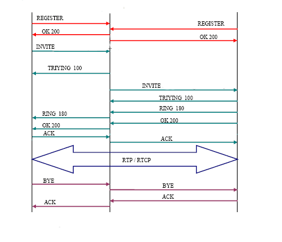

## SIP Architecture（SIP架构）
会话发起协议（SIP）是由IETF MMUSIC工作组开发的协议，它是用于发起，修改和终止涉及多媒体元素（例如视频，语音，即时消息，在线游戏和虚拟现实）的交互式用户会话的提议标准。 。由于2002年新的[RFC 3261](https://www.ietf.org/rfc/rfc3261.txt）<br>的发布，它最初于1996年以RFC 2543的形式发布，现在已过时。

SIP可以为音频/视频会议，交互式游戏和呼叫转移等功能建立会话，以通过IP网络进行部署，从而使服务提供商能够将基本IP电话服务与Web，电子邮件和聊天服务集成在一起。一个例子是从MegaPath进行[SIP中继](http://www.megapath.com/voice/sip-trunking/）<br>

SIP的主要目标是多媒体设备之间的通信。SIP通过两种协议使通信成为可能：RTP / RTCP和SDP。

RTP协议用于实时传输语音数据（与H.323协议相同），而SDP协议用于协商参与者的能力，编码类型等。

SIP的设计符合Internet模型。这是一种面向端到端的信令协议，这意味着所有逻辑都存储在终端设备中（SIP消息的路由除外）。状态也仅存储在终端设备中，没有单点故障，以这种方式设计的网络可以很好地扩展。我们必须为分布性和可伸缩性付出的代价是更高的消息开销，这是由于消息是端对端发送的。

因此，SIP是应用程序层控制协议，即Internet电话的信令协议。SIP可以为音频/视频会议，交互式游戏和呼叫转移等功能建立会话，以通过IP网络进行部署从而使服务提供商能够将基本IP电话服务与Web，电子邮件和聊天服务集成在一起。它基于请求和应答消息，并重用了许多先前标准的概念，例如HTTP和SMTP。

## SIP Components(SIP组件）<br>
SIP支持建立和结束多媒体会话的功能：位置，可用性，资源使用和协商功能。

为了实现这些功能，有不同的SIP组件。有两个主要元素，用户代理（UA）和SIP服务器（user agents (UA）<br> and SIP servers）


1. User Agent (UA）<br>用户代理:
它们具有两个不同的部分，用户代理客户端（UAC）和用户代理服务器（UAS）。UAC是发送SIP请求并接收这些请求的答案的逻辑实体。UAS是发送对SIP请求的答案的逻辑实体。

两个实体都在每个用户代理中，以允许客户端-服务器通信中不同用户代理之间的通信

2.有3种不同的SIP服务器

- 代理服务器（Proxy Server）：他们重新发送请求，并决定必须将消息发送到的服务器，并在必要时更改请求字段。它是一个中间实体，充当客户端和服务器，以便在用户之间建立呼叫。该服务器具有与HTTP代理类似的功能。它的任务是路由从其他实体收到的请求。代理服务器有两种类型：有状态代理和无状态代理

- Stateful Proxy（有状态的代理）: 它们在请求处理期间保留事务的状态。它允许将请求消息分为几个（派生），目的是并行查找被调用的位置，以获得最佳路径。

- Stateless Proxy （无状态的代理）: 它们在请求处理期间不保留事务状态，它们仅重新发送消息。

- Registrar Server (注册服务器）<br> : 是接受注册用户的请求，并保持这些请求信息的服务器。它在其域中提供位置和地址转换服务

- Redirect Server (重定向服务器）<br> : 这是一种服务器，它为接收到的请求生成重定向答案。该服务器再次将请求路由到下一个服务器。

这些类别仅是概念上的，它们都可以放在同一台机器上。它们也可以位于不同的计算机中以解决可伸缩性或处理问题。

## SIP消息(SIP Message）<br>

SIP是基于文本的协议，其使用与HTTP类似的语义。UAC发出请求，UAS返回客户请求的答案。SIP通过两种消息定义通信。请求（方法）和答案（状态码）使用[RFC 2822](https://www.ietf.org/rfc/rfc2822.txt）<br>的通用格式。它们有一个第一行，后跟一个或多个标题字段，一个空行显示头的末端，最后是消息正文（可选）。

### SIP Methods(SIP 方法）<br>

SIP请求中最重要的是消息的初始行，称为请求行。它包含方法名称，请求地址标识符（Request-URI）和SIP协议版本。客户端请求有六种基本方法（在RFC 254中定义）：

- INVITE: Let invite a user or a service to a new session or to modify parameters of a established session.
（允许邀请用户或服务加入新会话或修改已建立会话的参数。）
- ACK: Confirm the session establishment （确认会话建立）
- OPTION: Request information about the capabilities of a server （有关服务器的性能要求信息）
- BYE: End of a session （会话结束）
- CANCEL: Cancel a pending request. （取消挂起的请求。）
- REGISTER: Register the user agent. （注册用户代理。）

但是，可以使用其他方法。例如INFO，SUBSCRIBER等（在其他RFC中发布）例如，您可以在此处看到注册方法的真实示例： 


```
Via: SIP/2.0/UDP 192.168.0.100:5060;rport;branch=z9hG4bK646464100000000b43c52d6c00000d1200000f03
Content-Length: 0
Contact: <sip:20000@192.168.0.100:5060>
Call-ID: ED9A8038-A29D-40AB-95B1-0F5F5E905574@192.168.0.100
CSeq: 36 REGISTER
From: <sip:20000@192.168.0.101>;tag=910033437093
Max-Forwards: 70
To: <sip:20000@192.168.0.101>
User-Agent: SJphone/1.60.289a (SJ Labs）<br>
Authorization: Digest username="20000",realm="192.168.0.101",nonce="43c52e9d29317c0bf1f885b9aaff1522d93c7692"
,uri="192.168.0.101",response="f69463b8d3efdb87c388efa9be1a1e63"
```

### SIP Answers (State Codes）<br> 
在收到SIP请求消息后，接收方会回答一条消息。该消息与上一条消息相似，但是第一行称为状态行，其中包含SIP版本，应答代码（状态代码）和简短描述（原因短语）。答案的代码由三位数组成，可以对不同类型进行分类。第一位数字定义答案类别

Class Code
1xx - Provisional Messages. 
2xx - Success Answers.
3xx - Redirection Answers.
4xx - Method Failures.
5xx - Server Failures.
6xx - Global Failures.

这是一个200成功的回答示例：

```
Internet Protocol, Src Addr: 192.168.0.101 (192.168.0.101）<br>, Dst Addr:
192.168.0.100 (192.168.0.100）<br>
User Datagram Protocol, Src Port: 5060 (5060）<br>, Dst Port: 5060 (5060）<br>
Session Initiation Protocol
Status-Line: SIP/2.0 200 OK
Status-Code: 200
Resent Packet: False
Via: SIP/2.0/UDP 192.168.0.100:5060;rport;branch=z9hG4bK646464100000000b43c52d6c00000d1200000f03
Content-Length: 0
Contact: <sip:20100@192.168.0.100:5060>
Call-ID: ED9A8038-A29D-40AB-95B1-0F5F5E905574@100.100.100.16
CSeq: 36 REGISTER
From: <sip:20000@192.168.0.101>;tag=910033437093
Max-Forwards: 70
To: <sip:20000@192.168.0.101:5060>
Authorization:Digest username="20100",realm="192.168.0.101",nonce="43c52e9d29317c0bf1f885b9aaff1522d93c7692",uri="sip:192.168.0.101",
response="f69463b8d3efdb87c388efa9be1a1e63"
```

### SIP Error Messages
下表详细说明了显示在SIP消息中的最常见错误。

如前所述，它们与以下类型匹配：

```
4xx - Method Failures.
5xx - Server Failures.
6xx - Global Failures.
```

这些SIP错误消息可以转换为Q.931或DSS1错误消息：如下表所示，映射了SIP错误以及DSS1和Q.931错误。

表：SIP事件和DSS1代码之间的映射。

<table border="1" class="normal">
                <tbody><tr class="titulo_post_peq">
                  <th width="159">SIP event </th>
                  <th width="80"><div align="center">Decimal<br>
        Cause number (DSS1）<br> </div></th>
                  <th width="80" align="right"><div align="center">Hex.<br>
        Cause number (DSS1）<br> </div></th>
                  <th width="80"><div align="center">Value as transmitted in D-channel </div></th>
                  <th width="279"><div align="left">Cause</div></th>
                </tr>
                <tr>
                  <td><strong> 400 Bad request </strong></td>
                  <td width="80"><div align="center">127</div></td>
                  <td width="80" align="right"><div align="center">7f</div></td>
                  <td width="80" align="right"><div align="center">ff</div></td>
                  <td align="right">
                    <div align="left">Interworking, unspecified </div></td>
                </tr>
                <tr>
                  <td><strong> 401 Unauthorized </strong></td>
                  <td width="80"><div align="center">57</div></td>
                  <td width="80" align="right"><div align="center">39</div></td>
                  <td width="80" align="right"><div align="center">b9</div></td>
                  <td align="right">
                    <div align="left">Bearer capability not authorized </div></td>
                </tr>
                <tr>
                  <td><strong> 402 Payment required </strong></td>
                  <td width="80"><div align="center">21</div></td>
                  <td width="80" align="right"><div align="center">15</div></td>
                  <td width="80" align="right"><div align="center">95</div></td>
                  <td align="right">
                    <div align="left">Call rejected </div></td>
                </tr>
                <tr>
                  <td><strong> 403 Forbidden</strong></td>
                  <td width="80"><div align="center">57</div></td>
                  <td width="80" align="right"><div align="center">39</div></td>
                  <td width="80" align="right"><div align="center">b9</div></td>
                  <td align="right">
                    <div align="left">Bearer capability not authorized </div></td>
                </tr>
                <tr>
                  <td><strong> 404 Not found</strong></td>
                  <td width="80"><div align="center">1</div></td>
                  <td width="80" align="right"><div align="center">01</div></td>
                  <td width="80" align="right"><div align="center">81</div></td>
                  <td align="right"><div align="left"> Unallocated (unassigned）<br> number </div></td>
                </tr>
                <tr>
                  <td><strong> 405 Method not allowed </strong></td>
                  <td width="80"><div align="center">127</div></td>
                  <td width="80" align="right"><div align="center">7f</div></td>
                  <td width="80" align="right"><div align="center">ff</div></td>
                  <td align="right"><div align="left"> Interworking, unspecified </div></td>
                </tr>
                <tr>
                  <td><strong> 406 Not acceptable </strong></td>
                  <td width="80"><div align="center">127</div></td>
                  <td width="80" align="right"><div align="center">7f</div></td>
                  <td width="80" align="right"><div align="center">ff</div></td>
                  <td align="right"><div align="left">Interworking, unspecified </div></td>
                </tr>
                <tr>
                  <td><strong> 407 Proxy authentication required </strong></td>
                  <td width="80"><div align="center">21</div></td>
                  <td width="80" align="right"><div align="center">15</div></td>
                  <td width="80" align="right"><div align="center">95</div></td>
                  <td align="right"><div align="left"> Call rejected </div></td>
                </tr>
                <tr>
                  <td><strong> 408 Request timeout </strong></td>
                  <td width="80"><div align="center">102</div></td>
                  <td width="80" align="right"><div align="center">66</div></td>
                  <td width="80" align="right"><div align="center">e6</div></td>
                  <td align="right"><div align="left"> Recover on Expires timeout </div></td>
                </tr>
                <tr>
                  <td><strong> 409 Conflict </strong></td>
                  <td width="80"><div align="center">41</div></td>
                  <td width="80" align="right"><div align="center">29</div></td>
                  <td width="80" align="right"><div align="center">a9</div></td>
                  <td align="right"><div align="left"> Temporary failure </div></td>
                </tr>
                <tr>
                  <td><strong> 410 Gone </strong></td>
                  <td width="80"><div align="center">1</div></td>
                  <td width="80" align="right"><div align="center">01</div></td>
                  <td width="80" align="right"><div align="center">81</div></td>
                  <td align="right"><div align="left"> Unallocated (unassigned）<br> number </div></td>
                </tr>
                <tr>
                  <td><strong> 411 Length required </strong></td>
                  <td width="80"><div align="center">127</div></td>
                  <td width="80" align="right"><div align="center">7f</div></td>
                  <td width="80" align="right"><div align="center">ff</div></td>
                  <td align="right"><div align="left"> Interworking, unspecified </div></td>
                </tr>
                <tr>
                  <td><strong> 413 Request entity too long </strong></td>
                  <td width="80"><div align="center">127</div></td>
                  <td width="80" align="right"><div align="center">7f</div></td>
                  <td width="80" align="right"><div align="center">ff</div></td>
                  <td align="right"><div align="left"> Interworking, unspecified </div></td>
                </tr>
                <tr>
                  <td><strong> 414 Request URI (URL）<br> too long </strong></td>
                  <td width="80"><div align="center">127</div></td>
                  <td width="80" align="right"><div align="center">7f</div></td>
                  <td width="80" align="right"><div align="center">ff</div></td>
                  <td align="right"><div align="left"> Interworking, unspecified </div></td>
                </tr>
                <tr>
                  <td><strong> 415 Unsupported media type </strong></td>
                  <td width="80"><div align="center">79</div></td>
                  <td width="80" align="right"><div align="center">4f</div></td>
                  <td width="80" align="right"><div align="center">cf</div></td>
                  <td align="right"><div align="left"> Service or option not available </div></td>
                </tr>
                <tr>
                  <td><strong> 420 Bad extension </strong></td>
                  <td width="80"><div align="center">127</div></td>
                  <td width="80" align="right"><div align="center">7f</div></td>
                  <td width="80" align="right"><div align="center">ff</div></td>
                  <td align="right"><div align="left"> Interworking, unspecified </div></td>
                </tr>
                <tr>
                  <td><strong> 480 Temporarily unavailable </strong></td>
                  <td width="80"><div align="center">18</div></td>
                  <td width="80" align="right"><div align="center">12</div></td>
                  <td width="80" align="right"><div align="center">92</div></td>
                  <td align="right"><div align="left"> No user response </div></td>
                </tr>
                <tr>
                  <td><strong> 481 Call leg does not exist </strong></td>
                  <td width="80"><div align="center">127</div></td>
                  <td width="80" align="right"><div align="center">7f</div></td>
                  <td width="80" align="right"><div align="center">ff</div></td>
                  <td align="right"><div align="left"> Interworking, unspecified </div></td>
                </tr>
                <tr>
                  <td><strong> 482 Loop detected </strong></td>
                  <td width="80"><div align="center">127</div></td>
                  <td width="80" align="right"><div align="center">7f</div></td>
                  <td width="80" align="right"><div align="center">ff</div></td>
                  <td align="right"><div align="left"> Interworking, unspecified </div></td>
                </tr>
                <tr>
                  <td><strong> 483 Too many hops </strong></td>
                  <td width="80"><div align="center">127</div></td>
                  <td width="80" align="right"><div align="center">7f</div></td>
                  <td width="80" align="right"><div align="center">ff</div></td>
                  <td align="right"><div align="left"> Interworking, unspecified </div></td>
                </tr>
                <tr>
                  <td><strong> 484 Address incomplete </strong></td>
                  <td width="80"><div align="center"> 28</div></td>
                  <td width="80" align="right"><div align="center">1c</div></td>
                  <td width="80" align="right"><div align="center">9c</div></td>
                  <td align="right"><div align="left"> Address incomplete (invalid number format）<br> </div></td>
                </tr>
                <tr>
                  <td><strong> 485 Address ambiguous </strong></td>
                  <td width="80"><div align="center">1</div></td>
                  <td width="80" align="right"><div align="center">01</div></td>
                  <td width="80" align="right"><div align="center">81</div></td>
                  <td align="right"><div align="left"> Unallocated (unassigned）<br> number </div></td>
                </tr>
                <tr>
                  <td><strong> 486 Busy here </strong></td>
                  <td width="80"><div align="center">17</div></td>
                  <td width="80" align="right"><div align="center">11</div></td>
                  <td width="80" align="right"><div align="center">91</div></td>
                  <td align="right"><div align="left"> User busy </div></td>
                </tr>
                <tr>
                  <td><strong> 487 Request cancelled </strong></td>
                  <td width="80"><div align="center">127</div></td>
                  <td width="80" align="right"><div align="center">7f</div></td>
                  <td width="80" align="right"><div align="center">ff</div></td>
                  <td align="right"><div align="left"> Interworking, unspecified </div></td>
                </tr>
                <tr>
                  <td><strong> 488 Not acceptable here </strong></td>
                  <td width="80"><div align="center">127</div></td>
                  <td width="80" align="right"><div align="center">7f</div></td>
                  <td width="80" align="right"><div align="center">ff</div></td>
                  <td align="right"><div align="left"> Interworking, unspecified </div></td>
                </tr>
                <tr>
                  <td><strong> 500 Internal server error </strong></td>
                  <td width="80"><div align="center">41</div></td>
                  <td width="80" align="right"><div align="center">29</div></td>
                  <td width="80" align="right"><div align="center">a9</div></td>
                  <td align="right"><div align="left"> Temporary failure </div></td>
                </tr>
                <tr>
                  <td><strong> 501 Not implemented </strong></td>
                  <td width="80"><div align="center">79</div></td>
                  <td width="80" align="right"><div align="center">4f</div></td>
                  <td width="80" align="right"><div align="center">cf</div></td>
                  <td align="right"><div align="left"> Service or option not implemented </div></td>
                </tr>
                <tr>
                  <td><strong> 502 Bad gateway </strong></td>
                  <td width="80"><div align="center">38</div></td>
                  <td width="80" align="right"><div align="center">26</div></td>
                  <td width="80" align="right"><div align="center">a6</div></td>
                  <td align="right"><div align="left"> Network out of order </div></td>
                </tr>
                <tr>
                  <td><strong> 503 Service unavailable </strong></td>
                  <td width="80"><div align="center">63</div></td>
                  <td width="80" align="right"><div align="center">3f</div></td>
                  <td width="80" align="right"><div align="center">bf</div></td>
                  <td align="right"><div align="left"> Service or option unavailable </div></td>
                </tr>
                <tr>
                  <td><strong> 504 Gateway timeout </strong></td>
                  <td width="80"><div align="center">102</div></td>
                  <td width="80" align="right"><div align="center">66</div></td>
                  <td width="80" align="right"><div align="center">e6</div></td>
                  <td align="right"><div align="left"> Recover on Expires timeout </div></td>
                </tr>
                <tr>
                  <td><strong> 505 Version not implemented </strong></td>
                  <td width="80"><div align="center">127</div></td>
                  <td width="80" align="right"><div align="center">7f</div></td>
                  <td width="80" align="right"><div align="center">ff</div></td>
                  <td align="right"><div align="left"> Interworking, unspecified </div></td>
                </tr>
                <tr>
                  <td><strong> 580 Precondition Failed </strong></td>
                  <td width="80"><div align="center">47</div></td>
                  <td width="80" align="right"><div align="center">2f</div></td>
                  <td width="80" align="right"><div align="center">af</div></td>
                  <td align="right"><div align="left"> Resource unavailable, unspecified </div></td>
                </tr>
                <tr>
                  <td><strong> 600 Busy everywhere </strong></td>
                  <td width="80"><div align="center">17</div></td>
                  <td width="80" align="right"><div align="center">11</div></td>
                  <td width="80" align="right"><div align="center">91</div></td>
                  <td align="right"><div align="left"> User busy </div></td>
                </tr>
                <tr>
                  <td><strong> 603 Decline </strong></td>
                  <td width="80"><div align="center">21</div></td>
                  <td width="80" align="right"><div align="center">15</div></td>
                  <td width="80" align="right"><div align="center">95</div></td>
                  <td align="right"><div align="left"> Call rejected </div></td>
                </tr>
                <tr>
                  <td><strong> 604 Does not exist anywhere </strong></td>
                  <td width="80"><div align="center">1</div></td>
                  <td width="80" align="right"><div align="center">01</div></td>
                  <td width="80" align="right"><div align="center">81</div></td>
                  <td align="right"><div align="left"> Unallocated (unassigned）<br> number </div></td>
                </tr>
                <tr>
                  <td><strong> 606 Not acceptable </strong></td>
                  <td width="80"><div align="center">58</div></td>
                  <td width="80" align="right"><div align="center">3a</div></td>
                  <td width="80" align="right"><div align="center">ba</div></td>
                  <td align="right"><div align="left"> Bearer capability not presently available </div></td>
                </tr>
              </tbody></table>

### SIP Headers
标头用于将信息传输到SIP实体。主要字段是：

- Via: shows the transport protocol used and the request route, each proxy adds a line to this field 
(显示使用的传输协议和请求路由，每个代理在此字段添加一行）<br>
- From: shows the address of the caller. (显示呼叫者的地址）<br>
- To: show the called user address of the request. (显示请求的被叫用户地址）<br>
- Call-Id: Unique identifier for each call and contains the host address. It must be the same for all the messages within a transaction.
(每个呼叫的唯一标识符，包含主机地址。对于事务中的所有消息，它必须相同。）<br>
- Cseq: begins with a random number and it identifies in a sequential way each message. 
(以随机数开头，并按顺序标识每个消息）<br>
- Contact : shows one (or more）<br> address than can be used to contact the user
(显示一个（或多个）地址，该地址不能用于联系用户）<br>
- User Agent: The client agent who deals the communication.(进行通信的客户代理。）<br>

Message Header

```
Via: SIP/2.0/UDP 192.168.0.100:5060;rport;branch=z9hG4bK646464100000007343c52679000020a600000e45
Content-Length: 0
Call-ID: 911D32E5-EEDF-4572-B0B2-61B294636E88@192.168.0.100
CSeq: 1 ACK
From: "Prueba"<sip:20000@miasterisk.com>;tag=8922404614682
Max-Forwards: 70
Route: <sip:20001@192.168.0.1>
To: <sip:20001@miasterisk.com>;tag=as0a27b928
User-Agent: SJphone/1.60.289a (SJ Labs）<br>
Contact: <sip:20100@192.168.0.100:5060>;expires=3600
```

### SIP Addressing （SIP 寻址）
SIP服务器功能之一是用户位置和名称解析。通常，用户代理不知道被叫者的IP地址，只知道其“电子邮件”。

SIP实体通过[RFC 2396](https://www.ietf.org/rfc/rfc2396.txt）<br>中定义的SIP URI（统一资源标识符）来标识用户。SIP URI的格式类似于电子邮件中的一种，由用户和以一个@分隔的域组成，如以下示例所示：

```
user@domain, where domain is a full domain name. domain是完整的域名。
user@machine, where machine is the name of the machine. machine是计算机的名称。
user@ip_address, where address is the IP address of the machine.其中address是计算机的IP地址。
telephone_number@gateway, where the gateway allow to access through the PSTN to the called number 其中网关允许通过PSTN访问被叫号码
```

SIP识别解决方案也可以基于[RFC 3263](https://www.ietf.org/rfc/rfc3263.txt）<br>中描述的DNS，其中描述了客户端用于在IP地址，端口和传输协议中转换SIP URI或服务器用于返回SIP URI的DNS过程。如果请求失败，请向客户端答复。


### SDP
SDP Protocol (Session Description Protocol）<br> (会话描述协议）<br> [RFC 2327](https://www.ietf.org/rfc/rfc2327.txt）<br>用于实时描述多播会话，可用于邀请，公告和任何其他类型的会话设置。

SDP的原始建议旨在宣布参与者和组播MBONE（组播骨干）应用程序所需的信息。目前，它的用途已扩展到多媒体会话的宣布和协商。

由于SDP是描述协议，因此可以通过不同的协议（例如SIP，SAP，RTSP，带有MIME应用程序的电子邮件或类似HTTP的协议）来传输SDP消息。SDP使用文本编码。SDP消息由称为字段的行组成，其中名称由单个字母标识。SDP并非旨在易于扩展。

向SDP添加新功能的唯一方法是定义新属性。但是，未知属性可以忽略。下表说明了所有字段。

Type Description

V Protocol Version (mandatory）<br> 
o Identifier (mandatory）<br>
S Session Name (mandatory）<br>
I Session Information (mandatory）<br>
U Description URI <br>
e E-mail <br>
p Telephone Number <br>
C Connection Information <br>
b Bandwidth <br>
Z Correction Time <br>
K Key <br>
a Attributes <br>
T Session Start (Start y stop）(mandatory）<br>
R Repetition Time <br>
m Transport Protocol Information (media） (mandatory）<br>

Session Description Protocol Version (v）: 0 <br>
Owner/Creator, Session Id (o）: Cisco-SIPUA 26425 12433 IN IP4
192.168.0.100
Owner Username: Cisco-SIPUA <br>
Session ID: 26425 <br>
Session Version: 12433 <br>
Owner Network Type: IN <br>
Owner Address Type: IP4 <br>
Owner Address: 192.168.0.100 <br>
Session Name (s）: SIP Call <br>
Connection Information (c）: IN IP4 192.168.0.100 <br>
Connection Network Type: IN <br>
Connection Address Type: IP4 <br>
Connection Address: 192.168.0.100 <br>
Time Description, active time (t）<br>: 0 0
Session Start Time: 0 <br>
Session Stop Time: 0 <br>
Media Description, name and address (m）: audio 17338 RTP/AVP 0 8 18 101
Media Type: audio <br>
Media Port: 17338 <br> 
Media Proto: RTP/AVP <br>
Media Format: ITU-T G.711 PCMU <br>
Media Format: ITU-T G.711 PCMA <br>
Format: ITU-T G.729 <br>
Media Format: 101 <br>
Media Attribute (a）: rtpmap:0 PCMU/8000 <br>
Media Attribute (a）: rtpmap:8 PCMA/8000 <br>
Media Attribute (a）: rtpmap:18 G729/8000 <br>
Media Attribute (a）: rtpmap:101 telephone-event/8000 <br>
Media Attribute (a）: fmtp:101 0-15 <br>

### SIP Communication Example （SIP 通信示例）
在本节中，将详细分析呼叫。在SIP呼叫中，有几个SIP事务。一个SIP事务由多个请求和应答组成，并且通过CSeq参数将它们分组到同一事务中的方式。

User A	Proxy  User B



- 第一步是用户注册。用户必须注册自己才能被其他用户找到。在这种情况下，终端发送注册请求，其中字段“来自”和“至”对应于注册用户。充当注册者的代理服务器查询用户是否可以通过身份验证，如果没有问题，则发送OK消息。

- 以下事务对应于会话建立。该会话包括用户对代理的INVITE请求。代理立即发送TRYING 100停止广播，并将请求重新路由到B用户。当电话开始振铃时，B用户发送振铃180，并且代理也将其重新路由到A用户。最后，OK 200消息对应于接受过程（用户B响应呼叫）。

- 此时，呼叫已建立，并且RTP传输协议以SDP协议的参数（端口，地址，编解码器等）开始。

- 最后一笔交易对应一个会话结束。仅通过向代理发送BYE请求来执行此操作，然后将其重新路由到B用户。该用户答复OK 200消息，以确认已正确接收到最后一条消息。


